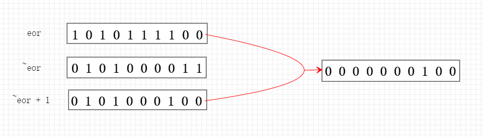
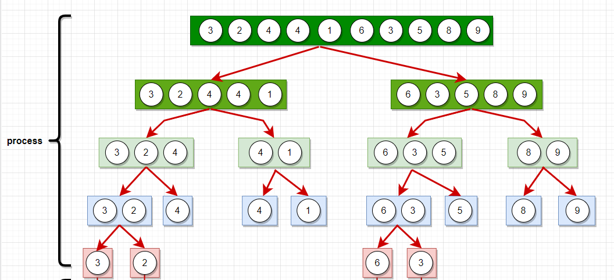
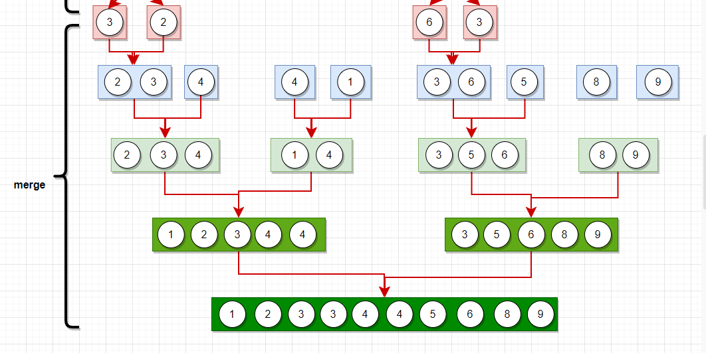

# 算法

# 排序算法

交换的方法

```java
public static void swap(int[] arr, int i, int j){
    int tmp = arr[i];
    arr[i] = arr[j];
    arr[j] = tmp;
}
```


## 选择排序

```java
public static void selectionSort(int[] arr){
    if(arr.length < 2 || arr == null){
        return;
    }
    //从i开始遍历到arr.length-1,把最小的数放到i位置
    for(int i = 0; i < arr.length; i++){
        //设i位置最小
        int minIndex = i;
        for(int j = i + 1; j < arr.length; j++){
            minIndex = arr[minIndex] < arr[j] ? minIndex : j;
        }
        //交换,把最小的数放在i位置
        swap(arr, i, minIndex);
    }
}

public static void swap(int[] arr, int i, int j){
    int tmp = arr[i];
    arr[i] = arr[j];
    arr[j] = tmp;
}
```

额外空间复杂度: $O(1)$

时间复杂度: $O(n^2)$

## 冒泡排序

```java
public static void bubbleSort(int[] arr){
    if(arr == null || arr.length < 2)
        return;
    //从0到i位置上依次进行比较,把较小的数往前移,从后面依次确定
    for(int i = arr.length - 1; i >= 0; i--){
        for(int j = 0; j < i; j++){
            if(arr[j] > arr[j + 1])
                swap(arr, j, j + 1)
        }
    }
}

//使用这种方法交换两个数必须保证i和j位置不同,否则最终结果将变成0
public static void swap(int[] arr, int i, int j){
    arr[i] = arr[i] ^ arr[j];  //=> a = i ^ j, b = j
    arr[j] = arr[i] ^ arr[j];  //=> a = i ^ j, b = j ^ i ^ j = i
    arr[i] = arr[i] ^ arr[j];  //=> a = i ^ j ^ i = j, b = j
}
```

异或运算: 相同为0, 不同为1

一个非空数组, 除了某两个元素只出现一次以外,其余全部出现两次, 找出这两个元素:

```java
public static void printOddTimesNum2(int[] arr){
    int eor = 0;
    for(int i : arr){
        eor ^= i;
    }
    //eor = a ^ b
    //eor必然有一个位置上为1
    //提取出最右侧的1
    int rightOnt = eor & (~eor + 1);
    
    int onlyOne = 0;
    for(int cur : arr){
        if((cur & rightOne) == 1){
            onlyOne ^= cur;
        }
    }
    System.out.println(onlyOne + " " + (eor ^ onlyOne));
}
```




## 插入排序

遍历数组, 保证0-i位置上的数有序

某个i位置上的数比左边的数小, 则一直与左边的数交换到左边的数不小于该位置上的数

时间复杂度与数据的状况有关

时间复杂度根据状况最差的时候来考虑

```java
public static void insertionSort(int[] arr){
    if(arr == null || arr.length < 2){
        return;
    }
    for(int i = 1; i < arr.length; i++){
        for(int j = i - 1; j >= 0 && arr[j] > arr[i]; j--){
            swap(arr, j, j + 1);
        }
    }
}
```

时间复杂度: $O(n^2)$

空间复杂度: $O(1)$


**测试器**

用于检验自己写的算法有没有错误

```java
public static void main(String[] args){
    int testTime = 500000;
    int maxSize = 100;
    int maxValue = 100;
    boolean succeed = true;
    for(int i = 0; i < testTime; i++){
        //随机生成一个数组
        int[] arr1 = generateRandomArray(maxSize, maxValue);
        int[] arr2 = copyArray(arr1);
        insertionSort(arr1);
        comparator(arr2);
        if(!isEqual(arr1, arr2)){
            //打印arr1
            //打印arr2
            succeed = false;
            break;
        }
        System.out.println(succeed ? "Nice" : "Fucking fucked!");
        
        int[] arr = generateRandomArray(maxSize, maxValue);
        printArray(arr);
        insertionSort(arr);
        printArray(arr);
    }
}
```

## 归并排序

将数组分成两部分, 先让左侧部分有序, 然后让右侧部分有序, 遍历两侧的数并比较相应位置的大小, 将较小的那个放入帮助数组中, 最后将结果放入arr中

```java
public static void mergeSort(int[] arr){
    if(arr == null || arr.length < 2)
        return;
    process(arr, 0, arr.length - 1);
}

public static void process(int[] arr, int L, int R){
    if(L == R){
        return;
    }
    int mid = L + ((R - L) >> 1);
    process(arr, L, mid);
    process(arr, mid + 1, R);
    merge(arr, L, mid, R);
}

public static void merge(int[] arr, int L, int M, int R){
    int[] help = new int[L - R + 1];
    if(L == R){
        return;
    }
    int i = 0;
    int p1 = L, p2 = M + 1;
    while(p1 <= M && p2 <= R){
        help[i++] = arr[p1] < arr[p2] ? arr[p1++] : arr[p2++];
    }
    while(p1 <= M){
        help[i++] = arr[p1++];
    }
    while(p2 <= R){
        help[i++] = arr[p2++];
    }
    for(i = 0; i < arr.length; i++){
        arr[L + i] = help[i];
    }
}
```





时间复杂度: $O(NlogN)$

额外空间复杂度：$$O(N)$$

## 快排

### 快排1.0

在整个数组中,将最后一个数做划分记为num, 然后把<=num的数放在整个数组的前半段,把>num的数放在后半段, 然后把num和后半段的第一个数做交换, 让左侧和右侧重复此行为


### 快排2.0

利用荷兰国旗问题

将最后一个数做划分num, 将<num的数放右边, =num的数放中间, >num的数放右边, 然后把最后一个数和>num的数的第一个数做交换, 左右两边做递归

```java
public static void quickSort(int[] arr){
    if(arr.length < 2 || arr == null){
        return;
    }
    quickSort(arr, 0, arr.length - 1);
}

//arr[l,,r]排好序
public static void quickSort(int[] arr, int L, int R){
    if(L < R){
        //在L到R上随机选一个数,把他放到最后的位置上
        swap(arr, L + (int)(Math.random() + (R - L + 1)), R);
        //p中包含两个数,就是等于区域的左边界和右边界
        int[] p = partition(arr, L, R);
        // < 区域
        quickSort(arr, L, p[0] - 1);
        // > 区域
        quickSort(arr, p[1] + 1, R);
    }
}
/**
 * 这是一个处理arr[l,,r]的函数
 * 默认以arr[r]做划分,arr[r] = p, 将整个数组分为 <p  ==p  >p三个部分
 * 返回等于区域(左边界, 右边界), 所以返回一个长度为2的数组res, res[0] res[1]
 */
public static int[] partition(int[] arr, int L, int R){
    // < 区右边界
    int less = L - 1;
    // > 区域左边界
    int more = R;
    // L表示当前数的位置 arr[R] --> 划分组
    while(L < more){
        //当前数 < 划分组
        if(arr[L] < arr[R]){
            swap(arr, ++less, L++);
        }
        //当前数 > 划分组
        else if(arr[L] > arr[R]){
            swap(arr, --more, L);
        }
        //当前数 == 划分组
        else{
            L++;
        }
    }
    swap(arr, more, R);
    return new int[] {less + 1, more};
}
```


两种版本的时间复杂度都是: $O(NlogN)$

额外空间复杂度: $O(logN)$


## 递归

求中点的位置:

$mid = (left + right) / 2 $	 => 可能会溢出

$mid = left + (right - left) / 2$    => 保证不会溢出

简化写法: $mid= left + (right - left) >> 1$


剖析递归行为和递归行为时间复杂度的估算

用递归方法找一个数组中的最大值

master公式的使用

$T(N) = a * T(N / b) + O(N^d)$

1. $log_ba > d$ -> 复杂度为$$O(N^{log(b,a)})$$
2. $log_ba = d$ -> 复杂度为$$O(N^d * logN)$$
3. $log_ba < d$ -> 复杂度为$$O(N^d)$$

母问题的数据量是N级别, 子过程的规模都是N/b的规模, 除了子问题的过程剩余的过程, a是子问题调用的次数


$\sqrt[2]{3}$

## 堆排序

把整个数组想象成一棵完全二叉树, 在某个i位置, 他的

左孩子: $2*i+1$

右孩子: $2*i+2$

父节点: $(i-1)/2$

堆排序就是大根堆, 即每一棵子树的头节点都是整棵树的最大值

小根堆即每一棵子树的头节点都是整棵树的最小值

遍历整个数组, 把数组变成一棵完全二叉树, 每读取一个数, 将他与其父节点比较, 如果比父节点大,则与父节点进行交换, 一直到比父节点小或者根节点

```java
```

